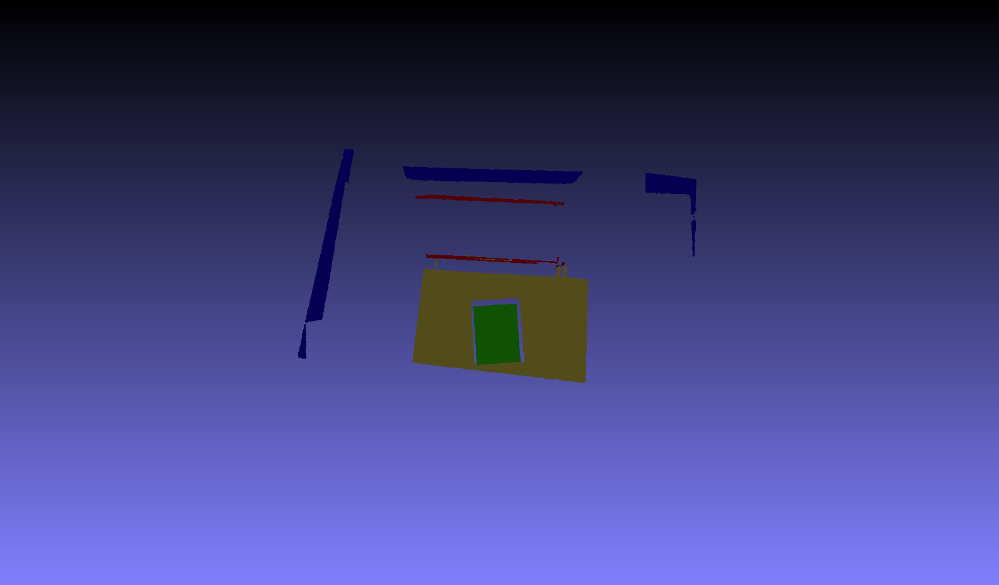
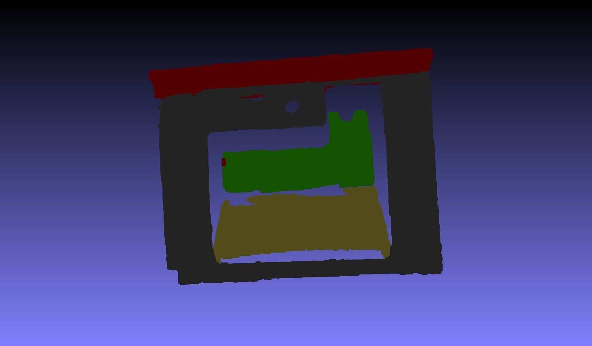

# Multiple Planes Detection

A fast and simple method for multi-plane detection from point clouds using iterative RANSAC plane fitting.

## Pre-requisite
- CMake
- Open3D >= 0.16.0 

## Usage

You can use PlaneSegmentation class to obtain planes.

## Results

